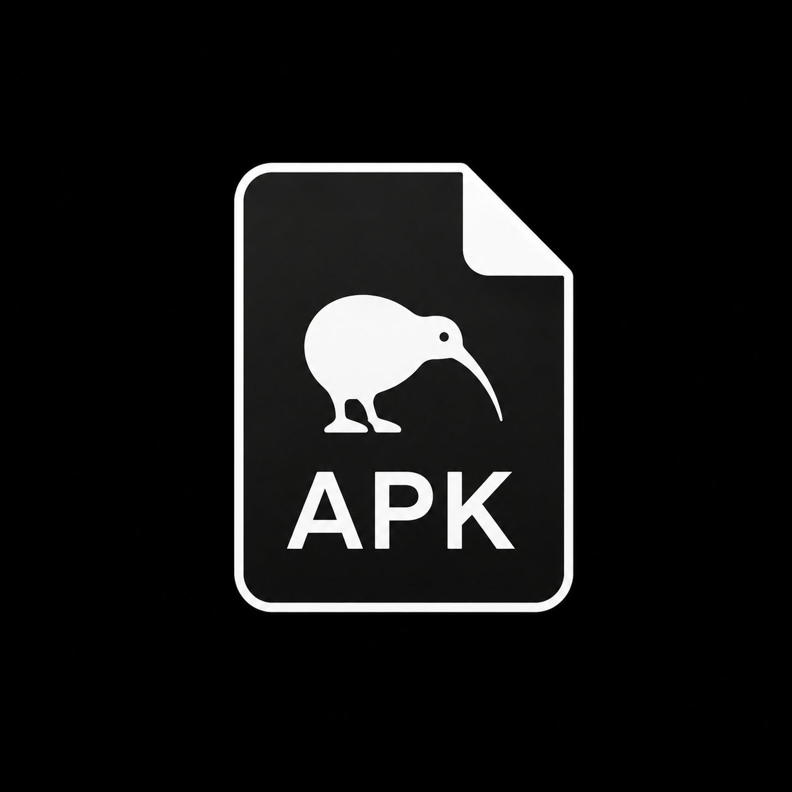

# APK Builder



Собирает Android-приложения (APK) прямо из HTML/CSS/JS кода. Без Android Studio, без SDK, без Gradle — всё делается из APK редактора на телефоне. Сборка идёт на серверах GitHub Actions, готовый APK автоматически скачивается.

## Что это

Мобильное приложение-редактор, которое берёт твой HTML-код, оборачивает его в нативное Android-приложение на WebView и собирает APK. Хостинг сборки — GitHub Actions (бесплатно до 2000 минут в месяц). Работает только как APK — устанавливается на Android-устройство.

Подходит для:
- Лендингов, портфолио, визиток
- Простых игр на JavaScript (canvas, память, три-в-ряд)
- Утилит — калькулятор, конвертер, заметки, TODO
- Каталогов, меню, расписаний, справочников
- Обёрток вокруг существующих сайтов и веб-сервисов

Не подходит без доработки:
- Push-уведомления (требуется Firebase FCM)
- Фоновые задачи (требуется WorkManager)
- Bluetooth, NFC, работа с железом
- Нативные виджеты Android

## Установка

1. Скачай файл `APK-Builder.apk`
2. Открой его на телефоне
3. Android спросит разрешение на установку из неизвестных источников — разреши:
   **Настройки → Безопасность → Установка неизвестных приложений → Разрешить для файлового менеджера**
4. Установи приложение

## Быстрый старт

### 1. Получи токен GitHub

1. Открой в браузере [github.com/settings/tokens](https://github.com/settings/tokens)
2. Нажми **Generate new token (classic)**
3. Отметь галочки:
   - `repo` — доступ к репозиториям
   - `workflow` — запуск GitHub Actions
4. Скопируй токен (начинается с `ghp_`)

Токен хранится **только внутри APK** и никуда, кроме `api.github.com`, не отправляется.

### 2. Заполни раздел GitHub

Открой вкладку **GitHub** в редакторе:

- **Токен** — вставь `ghp_...`
- **Имя пользователя** — твой логин на GitHub
- **Репозиторий** — любое имя, например `my-first-app`

Нажми **Проверить токен** — если всё ок, увидишь зелёный статус.

### 3. Напиши приложение

Перейди во вкладку **Код** и вставь HTML. Можно нажать **Вставить шаблон** — подставится минимальный пример с кнопкой.

Минимальный валидный HTML:

```html
<!DOCTYPE html>
<html>
<head>
  <meta charset="UTF-8">
  <meta name="viewport" content="width=device-width, initial-scale=1">
  <title>Моё приложение</title>
  <style>
    body { font-family: sans-serif; padding: 20px; }
    button { padding: 12px 24px; font-size: 16px; }
  </style>
</head>
<body>
  <h1>Привет!</h1>
  <button onclick="alert('Работает!')">Нажми меня</button>
</body>
</html>
```

### 4. Настрой проект

Вкладка **Проект**:

- **Название** — что будет под иконкой
- **Package name** — уникальный идентификатор, формат `com.имя.приложение`
- **Иконка** — PNG 512×512 или цветной квадрат с буквой
- **Версия** — `1.0` и `versionCode: 1` для первой сборки
- **Разрешения** — только те, что нужны приложению

### 5. Собери APK

Нажми **Собрать** в шапке. Откроется вкладка **Терминал**, где видно каждый шаг:

```
Проверка репозитория user/my-first-app
Создаю репозиторий
Генерация файлов проекта
  + settings.gradle
  + build.gradle
  ...
Создание коммита
Ожидание запуска Actions
Workflow #1 запущен
Ожидание сборки
  ... 30с (in_progress)
  ... 60с (in_progress)
Сборка завершена
Скачивание APK
APK сохранён: my_app.apk
```

Готовый APK появится в папке **Downloads** на телефоне. Установи его — это твоё приложение.

## Интерфейс

Пять вкладок внизу экрана:

| Вкладка | Что там |
|---|---|
| **Проект** | Название, package, иконка, версия, разрешения, цвет статус-бара |
| **Код** | HTML/CSS/JS приложения, шаблоны, предпросмотр |
| **GitHub** | Токен, имя пользователя, имя репозитория |
| **Файлы** | Список сохранённых проектов, экспорт/импорт, хранилище |
| **Терминал** | Логи сборки в реальном времени |

## Хранилище

Проекты сохраняются автоматически каждые 15 секунд и при сворачивании приложения. Используется нативный `SharedPreferences` через мост `AndroidStorage` — данные переживают перезапуск и переустановку.

Кнопки в разделе **Файлы**:

- **Сохранить сейчас** — принудительное сохранение
- **Новый** — создать проект с нуля
- **Дублировать** — копия текущего
- **Экспорт .json** — скачать проект в файл
- **Импорт .json** — загрузить проект из файла

Делай **экспорт `.json`** перед крупными изменениями. Это твой бэкап.

## Встроенные API для приложений

Внутри HTML-кода твоего приложения доступны нативные мосты Android:

### Сохранение данных

Работает надёжнее, чем `localStorage` — переживает переустановку приложения.

```javascript
AndroidStorage.set('ключ', 'значение');
const value = AndroidStorage.get('ключ');
AndroidStorage.remove('ключ');
```

Все значения — строки. Объекты сериализуй через `JSON.stringify`:

```javascript
AndroidStorage.set('user', JSON.stringify({ name: 'Иван', age: 30 }));
const user = JSON.parse(AndroidStorage.get('user') || '{}');
```

### Сохранение файлов

Принимает data URL, сохраняет в папку **Downloads**.

```javascript
// Сохранить текст
const text = 'Привет, мир!';
const blob = new Blob([text], { type: 'text/plain' });
const reader = new FileReader();
reader.onloadend = () => {
  AndroidFileSaver.saveBase64(reader.result, 'file.txt', 'text/plain');
};
reader.readAsDataURL(blob);
```

```javascript
// Скачать картинку
const dataUrl = canvas.toDataURL('image/png');
AndroidFileSaver.saveBase64(dataUrl, 'screenshot.png', 'image/png');
```

Оба моста работают в редакторе и в собранных им приложениях.

## Что работает в WebView

| Возможность | Работает | Примечание |
|---|---|---|
| HTML/CSS/JS | Да | Полностью |
| Fetch / XHR | Да | С разрешением «Интернет» |
| Canvas, WebGL | Да | |
| `localStorage` | Частично | Используй `AndroidStorage` |
| `IndexedDB` | Частично | Может блокироваться в WebView |
| `navigator.geolocation` | Да | С разрешением «Геолокация» |
| `getUserMedia` (камера) | Да | Только HTTPS или localhost |
| `MediaRecorder` (микрофон) | Да | С разрешением «Микрофон» |
| Скачивание файлов | Да | Через `AndroidFileSaver` |
| Загрузка файлов (`<input type=file>`) | Да | Открывается системный пикер |
| Clipboard API | Частично | Используй `document.execCommand` |

## Лимиты GitHub Actions

Бесплатный тариф — **2000 минут в месяц**. Одна сборка занимает ~2.5 минуты, но GitHub округляет до 3. Итого — примерно **600 сборок в месяц** или **30–50 приложений** с учётом пересборок.

Если упрёшься в лимит — `$0.008` за минуту. 500 лишних минут = **$4**.

## Частые проблемы

### «Токен недействителен»

Создай новый токен на [github.com/settings/tokens](https://github.com/settings/tokens) и проверь, что отмечены `repo` и `workflow`.

### «[409] Git Repository is empty»

Не баг. При первом пуше в пустой репозиторий GitHub отдаёт 409. Редактор автоматически ретраит запрос до 5 раз. Если ошибка повторяется — попробуй снова через минуту.

### «Repository creation failed»

**Пробелы в имени репозитория запрещены.** Используй латиницу, цифры, дефис, подчёркивание. Редактор сам заменяет пробелы на дефис, но старые записи могли остаться.

### APK не устанавливается

Причина обычно в конфликте package. Если приложение с таким `applicationId` уже стоит — удали старое или измени package в редакторе.

Или включи установку из неизвестных источников: **Настройки → Безопасность → Установка неизвестных приложений → Разрешить для файлового менеджера**.

### Проект пропал после перезапуска

Проверь в разделе **Файлы → Хранилище**. Должно быть:

- `Android (SharedPreferences)` — работает, всё сохраняется

Если показано `память (не сохраняется)` — APK редактора собран старой версией без нативного моста. Пересобери редактор.

### Сборка падает

Открой ссылку из красной строки в терминале — попадёшь на страницу GitHub Actions. Там видно конкретный упавший шаг и полный лог. Первые 60 строк ошибки показываются прямо в терминале редактора.

## Как это работает внутри

Редактор генерирует структуру Android-проекта в памяти и заливает её в репозиторий одним коммитом. Внутри:

```
settings.gradle
build.gradle
gradle.properties
app/
  build.gradle
  src/main/
    AndroidManifest.xml
    java/<package>/MainActivity.java
    res/
      mipmap-*/ic_launcher.png
      values/styles.xml
.github/workflows/build.yml
.gitignore
```

`MainActivity.java` содержит класс WebView, настройки хранилища, мосты `AndroidFileSaver` и `AndroidStorage`, обработчики выбора файлов и разрешений.

GitHub Actions автоматически запускает сборку при каждом коммите. Workflow использует Gradle 8.2 и Android Gradle Plugin 8.1.4, собирает debug APK и прикрепляет его как артефакт.

## Лицензия

MIT. Используй как хочешь, форкай, меняй, распространяй.

## Благодарности

Сборка работает на [GitHub Actions](https://github.com/features/actions). Зависимости — [JSZip](https://stuk.github.io/jszip/) для распаковки артефактов.

Сделано из интереса. Если пригодилось — расскажи друзьям.
